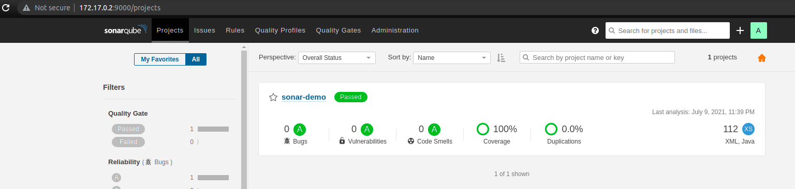
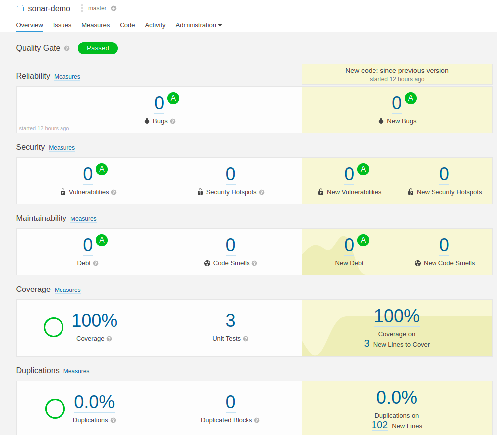
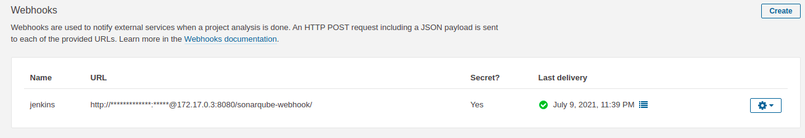

# SonarQube Demo

Demonstrate the capabilities of integrating sonarqube in declarative pipeline.

[PDF Version](readme.pdf)

## Features

* Sonarqube instance integration
* Jacoco code coverage

## Usage

You will have to host a sonarqube server instance in your development environment to start with.
Recommend spin up an instance as a container.
Ubuntu users

```shell
docker run -d --name sonarqube -e SONAR_ES_BOOTSTRAP_CHECKS_DISABLE=true -p 9000:9000 sonarqube:7.9.4-community
```
once the instance is up and running you will be able to access the sonarqube dashboard using

```http://<CONTAINER_IP>:9000/```



Build a lightweight SpringBoot application from [spring starter](https://start.spring.io/) or you could clone this repo.

Add the Jacoco maven plugin to your pom file.

```xml
<plugin>
  <groupId>org.jacoco</groupId>
  <artifactId>jacoco-maven-plugin</artifactId>
  <version>0.8.4</version>
  <executions>
    <execution>
      <goals>
        <goal>prepare-agent</goal>
      </goals>
    </execution>
    <execution>
      <id>report</id>
      <phase>prepare-package</phase>
      <goals>
        <goal>report</goal>
      </goals>
    </execution>
    <execution>
      <id>jacoco-check</id>
      <goals>
        <goal>check</goal>
      </goals>
      <configuration>
        <rules>
          <rule>
            <limits>
              <limit>
                <minimum>0.2</minimum>
              </limit>
            </limits>
          </rule>
        </rules>
      </configuration>
    </execution>
  </executions>
</plugin>
```

Recommend you spin up a jenkins instance as container which helps you to have an end to end view of how the sonarqube integration from pipeline works.

```shell
docker run -p 8080:8080 -p 50000:50000 jenkins/jenkins
```
Set up Jenkins with recommended plugins and install the below plugins under manage plugins section.

* Pipeline Declarative
* SonarQube Scanner for Jenkins

Go to **Manage Jenkins > Configure System > SonarQube servers**. Configure the instance of your Sonarqube.
Recommend adding a server authentication token which you will be managed to get from

**Sonarqube > Profile (My Account) > Security > Generate Token**

Create a user with appropriate permissions for Jenkins to authenticate.

Create a global maven settings in jenkins with sonar plugin. You could do it at artefact level as well.

```xml
<settings>
    <pluginGroups>
        <pluginGroup>org.sonarsource.scanner.maven</pluginGroup>
    </pluginGroups>
    <profiles>
        <profile>
            <id>sonar</id>
            <activation>
                <activeByDefault>true</activeByDefault>
            </activation>
        </profile>
     </profiles>
</settings>
```

This will help you to run the maven goal as ``mvn clean package sonar:sonar`` so that you don't really need to have an individual sonar scanner to be setup and explicitly supply sonar properties.
Maven automatically detects the artefact id and project properties and configure it for you.

Please use the declarative pipeline as below

```jenkins
    stage("Build Artefact") {
         steps {
              withSonarQubeEnv('sonarqube') {
                   cho "Building master ${BUILD_NUMBER}."
                   sh "mvn clean install sonar:sonar"
                   junit testResults: '**/target/*-reports/TEST-*.xml'
                   }

              }
         }

    stage("Quality Check") {
           steps {
               timeout(time: 3, unit: 'MINUTES') {
                     waitForQualityGate abortPipeline: true
                     }
               }
           }
```

Build Artefact stage will connect with sonarqube instance and submit your code for deep scanning with coverage report from JACOCO.
When you open sonarqube dashboard you will see a project created with your artefact id and the scan results will be published.



### Quality Gate

A beautiful concept which allows you to write a set of rules according to your organisation standards and guidelines for code quality.
Please visit the [documentation](https://docs.sonarqube.org/latest/user-guide/quality-gates/) and learn more.

You could add a Quality Check stage which allows you to determine the pipeline behaviour based on the report from sonarqube.
This stage will wait for the webhook to publish the report data back to jenkins and based on the result we can customize the build behaviour.

To achieve this make sure you have created a webhook pointing to your jenkins instance in sonarqube.

**Administration > Configuration > Webhooks**



The response will be a POST call with json body as below.

```json
{
  "serverUrl": "http://localhost:9000",
  "taskId": "AXqNbOA94FKCf7N2qdEC",
  "status": "SUCCESS",
  "analysedAt": "2021-07-09T22:39:15+0000",
  "revision": "7e90040965339e6aec1ce26a50f0f251777e12fd",
  "changedAt": "2021-07-09T22:39:15+0000",
  "project": {
    "key": "com.training.sonar:sonar-demo",
    "name": "sonar-demo",
    "url": "http://localhost:9000/dashboard?id=com.training.sonar%3Asonar-demo"
  },
  "branch": {
    "name": "master",
    "type": "LONG",
    "isMain": true,
    "url": "http://localhost:9000/dashboard?id=com.training.sonar%3Asonar-demo"
  },
  "qualityGate": {
    "name": "Standard",
    "status": "OK",
    "conditions": [
      {
        "metric": "new_reliability_rating",
        "operator": "GREATER_THAN",
        "value": "1",
        "status": "OK",
        "errorThreshold": "1"
      },
      {
        "metric": "new_security_rating",
        "operator": "GREATER_THAN",
        "value": "1",
        "status": "OK",
        "errorThreshold": "1"
      },
      {
        "metric": "new_maintainability_rating",
        "operator": "GREATER_THAN",
        "value": "1",
        "status": "OK",
        "errorThreshold": "1"
      },
      {
        "metric": "new_coverage",
        "operator": "LESS_THAN",
        "value": "100.0",
        "status": "OK",
        "errorThreshold": "60"
      },
      {
        "metric": "new_duplicated_lines_density",
        "operator": "GREATER_THAN",
        "value": "0.0",
        "status": "OK",
        "errorThreshold": "3"
      }
    ]
  },
  "properties": {}
}
```

## Note

Feel free to reach out the writer <vipinev9@gmail.com> for any queries.
